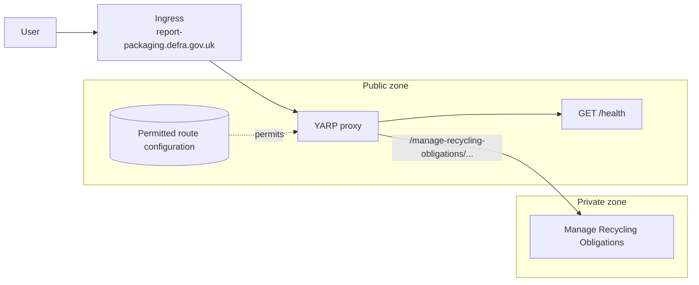

# Report packaging proxy

A .NET 10 YARP reverse proxy prepared for the CDP build and deployment approach used by
`cdp-node-frontend-template`.

## Behaviour

- `GET /health` is handled by this service and returns `200 OK` with `{ "message": "success" }`.
- The container listens on `PORT` (default `8085`) and includes `curl` for the CDP platform health check.

## Permitted-route design

The proxy will be a permit list: a request may be sent only to a downstream service with an explicitly configured
public path. The first known mapping is **Manage Recycling Obligations**.



Ingress is responsible for mapping the public domain to this proxy deployment, so YARP does not currently match on
`Hosts`. This keeps public hostnames out of application configuration; only each environment's downstream address
varies. If a future deployment serves more than one public domain, add `Hosts` back to every permitted YARP route.

### Manage Recycling Obligations

The agreed public prefix is `/manage-recycling-obligations`. The YARP configuration is:

```json
{
  "ReverseProxy": {
    "Routes": {
      "ManageRecyclingObligations": {
        "ClusterId": "ManageRecyclingObligations",
        "Match": {
          "Path": "/manage-recycling-obligations/{**catch-all}"
        },
        "Transforms": [
          {
            "PathRemovePrefix": "/manage-recycling-obligations"
          }
        ]
      }
    },
    "Clusters": {
      "ManageRecyclingObligations": {
        "Destinations": {
          "Primary": {
            "Address": "https://unconfigured.invalid/"
          }
        }
      }
    }
  }
}
```

`https://unconfigured.invalid/` is a fail-closed placeholder. The deployed service must override it with the full
base address of the relevant environment's Manage Recycling Obligations service, including a trailing slash.

```text
ReverseProxy__Clusters__ManageRecyclingObligations__Destinations__Primary__Address=https://manage-recycling-obligations.production.internal/
```

For example, the transform forwards the request below without the public routing prefix:

```text
Public request:     POST /manage-recycling-obligations/returns?year=2026
Downstream request: POST https://manage-recycling-obligations.production.internal/returns?year=2026
```

No `Methods` constraint is configured, so the permitted path accepts every HTTP method, including `POST`. The
`{**catch-all}` path segment permits every suffix beneath `/manage-recycling-obligations`; use additional exact
routes with `Methods` restrictions if individual downstream operations need a narrower allow-list. Paths that do not
match a permitted route return `404` from the proxy without reaching a downstream service.

## Run locally

```sh
dotnet restore spike-report-packaging-proxy.slnx
dotnet run --project src/Api
```

Then check the local endpoint:

```sh
curl http://localhost:8085/health
```

## Compose demonstration

```sh
docker compose up --build -d --wait
```

Compose starts the proxy and one WireMock downstream. The proxy's destination is overridden to `http://downstream:8080/`;
WireMock returns the expected canned response for `POST /returns?year=2026`. This demonstrates that the proxy removed
the public prefix before forwarding.

```sh
curl --fail --request POST 'http://localhost:8085/manage-recycling-obligations/returns?year=2026'
curl --include http://localhost:8085/not-permitted
```

The first command returns the WireMock response below. The second returns `404 Not Found`, even though WireMock has a
deliberate sentry response for `/not-permitted`; this proves the proxy did not forward the unpermitted path.

```json
{
  "method": "POST",
  "path": "/returns",
  "query": "?year=2026"
}
```

Stop the environment when finished:

```sh
docker compose down -v --remove-orphans
```

## Tests

Start the Compose environment first, then run the integration tests:

```sh
dotnet test tests/Api.IntegrationTests/Api.IntegrationTests.csproj --no-restore
```
