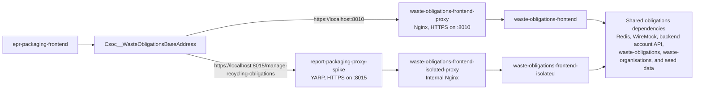

# Spike outcome

## Summary

The spike has shown that a CDP-hosted YARP reverse proxy can expose a logical downstream service beneath a public
path prefix without requiring that service to be deployed at the same prefix.

The first route, `/manage-recycling-obligations/{**catch-all}`, is explicitly permitted. The proxy removes that
public prefix before forwarding the request and supplies `X-Forwarded-Prefix` so that the downstream application can
generate URLs for its public location. All HTTP methods, including `POST`, are forwarded for the permitted route.
Any path which is not explicitly configured receives a `404 Not Found` from the proxy and is not forwarded
downstream.

## What the spike has proven

### Safe and observable routing

- The proxy uses an explicit route allow-list, rather than forwarding arbitrary paths.
- The routing integration tests prove prefix removal, `POST` forwarding, trace-header propagation, and rejection of
  an unpermitted path.
- `GET /health` remains local to the proxy and returns the CDP health-check contract: `200 OK` with
  `{ "message": "success" }`.
- The default downstream destination is the fail-closed `https://unconfigured.invalid/` placeholder. Startup
  validation prevents the service from running until every destination is configured with a real address.
- Structured request logging and propagation of the `x-cdp-request-id` CDP trace header give the proxy and its
  downstream correlated operational evidence. This request correlation has been observed working in CDP.

The proxy implementation was developed with routing integration tests, fail-closed configuration validation,
forwarded-prefix support, and trace-header correlation from the outset.

### Downstream application compatibility

The recent work in `waste-obligations-frontend` demonstrates that the approach supports a real user journey, not
just HTTP forwarding. The frontend now uses the trusted `X-Forwarded-Prefix` when producing authentication redirects,
assets, navigation and language-switcher links, back links, continue actions, and cookie paths. It also validates the
header before using it.

Its Playwright integration journeys run against both the application directly and through a proxy path, preventing
regressions in prefix handling. Subsequent cookie configuration also supports local dual-running without browser
cookie collisions.

### Local, HTTPS-based integration

`epr-local-environment` runs the packaging and obligations profiles together. This provides a local emulation of the
CDP service stack in which `epr-packaging-frontend` can call the Manage Recycling Obligations journey through either
the established direct route or the new report-packaging proxy route.

The direct setting is `Csoc__WasteObligationsBaseAddress=https://localhost:8010`. It sends
`epr-packaging-frontend` to the existing browser-facing Nginx proxy, which forwards to the standard
`waste-obligations-frontend` container.

Changing that setting to
`Csoc__WasteObligationsBaseAddress=https://localhost:8015/manage-recycling-obligations` sends the same request through
`report-packaging-proxy-spike`. The proxy removes the public path prefix and calls the internal
`waste-obligations-frontend-isolated-proxy`, which forwards to an isolated instance of the frontend. This gives the
test path the same two-stage proxy chain as the proposed CDP architecture: public routing by the YARP proxy, followed
by the downstream service's internal HTTPS endpoint.

The isolated frontend has no host port and is reachable only through the report proxy. It has distinct session, CSRF,
and OAuth-state cookie names, allowing the direct and proxy routes to run side-by-side on `localhost` without
interfering with one another. Both frontend instances use the same supporting obligations services: Redis, WireMock,
the backend account API, `waste-obligations`, `waste-organisations`, and seeded data. `epr-packaging-frontend` also
runs alongside its account-facade, payment-facade, and POM API dependencies.

This is therefore more than a standalone proxy demonstration: it emulates the CDP service stack and lets the
packaging frontend switch between the existing direct route and the proposed CDP proxy route during local testing.

### Environment-specific configuration

Downstream addresses are held in per-environment service configuration in
[`cdp-app-config`](https://github.com/DEFRA/cdp-app-config/tree/main/services/report-packaging-proxy-spike), rather
than application code. This allows each deployment environment to route to its own private downstream address.

The Code Owners approval gate on configuration changes provides a meaningful control against a rogue change that
would redirect or break a downstream routing path. It is a governance safeguard, rather than a replacement for
operational validation and monitoring.

## Recommendation

Create a CDP proxy service for each logical group of downstream services. Start each service from this repository's
bootstrap, configuration-validation, routing, logging, and trace-correlation patterns. This keeps the public routing
surface deliberately small and explicit, while allowing each proxy to be deployed, configured, monitored, and
supported independently.

## Enhancements to consider

An extended `/health/all` endpoint could report downstream availability while retaining the existing local `/health`
contract. Alternatively, a background process could continuously check downstream availability and publish custom
metrics or alarms. These would be useful enhancements, but are not prerequisites for adopting the routing pattern.

The hard `404` for an unmatched path is correct for the proxy's security and routing model. Its user impact still
needs deliberate consideration: entry points, navigation, authentication return URLs, error handling, and user
messaging must not leave users with a confusing journey when a path is missing or incorrect.
