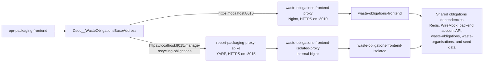
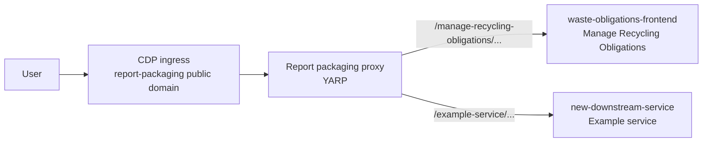

# Spike outcome

## Summary

The spike has shown that a CDP-hosted YARP reverse proxy can expose a logical downstream service beneath a public
path prefix without requiring that service to be deployed at the same prefix.

The first route, `/manage-recycling-obligations/{**catch-all}`, is explicitly permitted. The proxy removes that
public prefix before forwarding the request and supplies `X-Forwarded-Prefix` so that the downstream application can
generate URLs for its public location. All HTTP methods, including `POST`, are forwarded for the permitted route.
Any path which is not explicitly configured receives a `404 Not Found` from the proxy and is not forwarded
downstream.

## What the spike has proven

### Safe and observable routing

- The proxy uses an explicit route allow-list, rather than forwarding arbitrary paths.
- The routing integration tests prove prefix removal, `POST` forwarding, trace-header propagation, and rejection of
  an unpermitted path.
- `GET /health` remains local to the proxy and returns the CDP health-check contract: `200 OK` with
  `{ "message": "success" }`.
- The default downstream destination is the fail-closed `https://unconfigured.invalid/` placeholder. Startup
  validation prevents the service from running until every destination is configured with a real address.
- Structured request logging and propagation of the `x-cdp-request-id` CDP trace header give the proxy and its
  downstream correlated operational evidence. This request correlation has been observed working in CDP.

The proxy implementation was developed with routing integration tests, fail-closed configuration validation,
forwarded-prefix support, and trace-header correlation from the outset.

### Downstream application compatibility

The recent work in `waste-obligations-frontend` demonstrates that the approach supports a real user journey, not
just HTTP forwarding. The frontend now uses the trusted `X-Forwarded-Prefix` when producing authentication redirects,
assets, navigation and language-switcher links, back links, continue actions, and cookie paths. It also validates the
header before using it.

Its Playwright integration journeys run against both the application directly and through a proxy path, preventing
regressions in prefix handling. Subsequent cookie configuration also supports local dual-running without browser
cookie collisions.

### Local, HTTPS-based integration

`epr-local-environment` runs the packaging and obligations profiles together. This provides a local emulation of the
CDP service stack in which `epr-packaging-frontend` can call the Manage Recycling Obligations journey through either
the established direct route or the new report-packaging proxy route.



The direct setting is `Csoc__WasteObligationsBaseAddress=https://localhost:8010`. It sends
`epr-packaging-frontend` to the existing browser-facing Nginx proxy, which forwards to the standard
`waste-obligations-frontend` container.

Changing that setting to
`Csoc__WasteObligationsBaseAddress=https://localhost:8015/manage-recycling-obligations` sends the same request through
`report-packaging-proxy-spike`. The proxy removes the public path prefix and calls the internal
`waste-obligations-frontend-isolated-proxy`, which forwards to an isolated instance of the frontend. This gives the
test path the same two-stage proxy chain as the proposed CDP architecture: public routing by the YARP proxy, followed
by the downstream service's internal HTTPS endpoint.

The isolated frontend has no host port and is reachable only through the report proxy. It has distinct session, CSRF,
and OAuth-state cookie names, allowing the direct and proxy routes to run side-by-side on `localhost` without
interfering with one another. Both frontend instances use the same supporting obligations services: Redis, WireMock,
the backend account API, `waste-obligations`, `waste-organisations`, and seeded data. `epr-packaging-frontend` also
runs alongside its account-facade, payment-facade, and POM API dependencies.

This is therefore more than a standalone proxy demonstration: it emulates the CDP service stack and lets the
packaging frontend switch between the existing direct route and the proposed CDP proxy route during local testing.

### Environment-specific configuration

Downstream addresses are held in per-environment service configuration in
[`cdp-app-config`](https://github.com/DEFRA/cdp-app-config/tree/main/services/report-packaging-proxy-spike), rather
than application code. This allows each deployment environment to route to its own private downstream address.

The Code Owners approval gate on configuration changes provides a meaningful control against a rogue change that
would redirect or break a downstream routing path. It is a governance safeguard, rather than a replacement for
operational validation and monitoring.

## Example deployed state and adding a service

The diagram below shows the intended deployed pattern. Manage Recycling Obligations is the current route. The
`/example-service` route and `new-downstream-service` are illustrative additions; they show how a further service
would be exposed through the same proxy.



To add the example service:

1. Agree the public path, for example `/example-service`, the downstream's internal base address, and the user
   journey that will reach it. Retain the permit-list model: do not use a catch-all route that would expose unrelated
   downstream paths.
2. Add an `ExampleService` route and cluster to the proxy configuration. Match
   `/example-service/{**catch-all}`, remove `/example-service` before forwarding, and set
   `X-Forwarded-Prefix` to `/example-service`. Use the current Manage Recycling Obligations route as the template.
3. Give the cluster a default `https://unconfigured.invalid/` destination. The existing startup validation then
   prevents deployment until the destination has been overridden.
4. Add the `ReverseProxy__Clusters__ExampleService__Destinations__Primary__Address` setting to each required
   `cdp-app-config` environment, using the private downstream base address with its trailing slash. The normal
   Code Owners approval gate protects these routing changes.
5. Make the downstream ready to run behind the prefix. It must trust forwarded headers only from the proxy and use
   the forwarded prefix when generating any public URLs, redirects, authentication callbacks, assets, or cookie
   paths that are affected by the public route.
6. Add the downstream service to the relevant `epr-local-environment` profile and configure the local proxy
   destination. Exercise both the downstream journey and the client service that will call its new public path.
7. Add routing and end-to-end tests for the permitted path, prefix removal, all required HTTP methods, trace-header
   propagation, and an unpermitted path. Build and deploy the proxy, then verify request correlation and downstream
   behaviour in CDP.

## Runtime comparison: .NET and Node.js

This is a runtime comparison rather than a comparison of YARP with a particular Node.js proxy library. Both runtimes
can provide a capable reverse proxy, but their execution models have different operational characteristics.

| Runtime concern | .NET / Kestrel | Node.js | Reverse-proxy implication |
| --- | --- | --- | --- |
| Use of CPU cores | Thread pool and server GC are designed to use multiple cores within one process. | JavaScript runs on one event loop per process; full core use normally needs clustered processes or worker threads. | .NET has a simpler path to scaling a single proxy instance across available CPU. |
| High-concurrency I/O | Async I/O runs independently of application threads; blocked work is less likely to stop every connection. | Excellent async I/O model, but synchronous JavaScript on the event loop delays all requests served by that process. | .NET is more tolerant of occasional CPU-bound transforms, logging, or accidental blocking work. |
| Tail latency under load | Multiple worker threads can continue serving requests while another thread is busy. | A long event-loop task can raise latency for unrelated requests in the same process. | .NET is generally the safer runtime for predictable latency in a shared routing service. |
| Streaming large request and response bodies | Async pipelines support streaming with backpressure and minimal copying. | Streams also support this well. | Broadly comparable; both need careful implementation to avoid buffering bodies. |
| CPU work in the request path | Can execute concurrently across threads. | Must be kept off the event loop or moved to workers or processes. | .NET has less operational complexity if transforms, authentication, logging, or policy checks become CPU-heavy. |
| Garbage collection | Server GC is intended for throughput and multi-core server workloads and can be tuned for containers. | V8 has an efficient generational GC, but a pause or memory pressure affects the process's sole event loop. | Neither is immune to GC effects; .NET gives more server-oriented tuning options. |
| Fault isolation | A problematic request handler can consume threads, but other threads remain available. | A blocking handler affects every request handled by that event-loop process. | .NET reduces the blast radius of a badly behaved synchronous extension. |
| Process model | One process can efficiently use allocated CPU. | Multiple Node processes are commonly needed for equivalent CPU utilisation. | .NET tends to need less process-management configuration. |
| Startup time and baseline memory | Usually higher startup cost and memory footprint. | Often starts faster and has a smaller baseline footprint. | Node.js can be preferable for very small, bursty workloads. |
| Raw throughput | Typically very strong for HTTP workloads, especially with multiple cores available. | Also strong for I/O-heavy workloads when handlers remain lightweight and non-blocking. | Benchmark representative headers, TLS, payload sizes, and concurrency; do not rely on generic benchmark claims. |

The runtime argument for .NET is not that Node.js cannot proxy traffic. It is that a proxy is a shared,
latency-sensitive service, and .NET's multi-core execution model is more forgiving and operationally simpler as
routing, logging, security checks, and downstream policy accumulate.

## Recommendation

Create a CDP proxy service for each logical group of downstream services. Start each service from this repository's
bootstrap, configuration-validation, routing, logging, and trace-correlation patterns. This keeps the public routing
surface deliberately small and explicit, while allowing each proxy to be deployed, configured, monitored, and
supported independently.

## Enhancements to consider

An extended `/health/all` endpoint could report downstream availability while retaining the existing local `/health`
contract. Alternatively, a background process could continuously check downstream availability and publish custom
metrics or alarms. These would be useful enhancements, but are not prerequisites for adopting the routing pattern.

### Convention-based downstream destinations

The proxy could remove the need for a per-destination address in `cdp-app-config` if CDP guarantees a stable,
environment-specific naming convention. Each destination would instead declare only its service name, for example:

```json
{
  "Destinations": {
    "Primary": {
      "ServiceName": "waste-obligations-frontend"
    }
  }
}
```

At startup, a small resolver could combine the service name with one platform-provided environment variable, such as
`CDP_ENVIRONMENT=dev`, to populate the YARP address before configuration validation and `LoadFromConfig` run:

```csharp
var reverseProxyConfiguration = builder.Configuration.GetSection("ReverseProxy");
var cdpEnvironment = builder.Configuration["CDP_ENVIRONMENT"]
    ?? throw new InvalidOperationException("CDP_ENVIRONMENT must be configured.");

var addressOverrides = reverseProxyConfiguration
    .GetSection("Clusters")
    .GetChildren()
    .SelectMany(cluster =>
        cluster.GetSection("Destinations").GetChildren().Select(destination => new
        {
            Key = $"ReverseProxy:Clusters:{cluster.Key}:Destinations:{destination.Key}:Address",
            ServiceName = destination["ServiceName"]
                ?? throw new InvalidOperationException($"{cluster.Key}:{destination.Key} must have a service name."),
        })
    )
    .ToDictionary(
        x => x.Key,
        x => $"https://{x.ServiceName}.{cdpEnvironment}.cdp.cloud/"
    );

builder.Configuration.AddInMemoryCollection(addressOverrides);
reverseProxyConfiguration = builder.Configuration.GetSection("ReverseProxy");
ReverseProxyConfigurationValidator.Validate(reverseProxyConfiguration);
builder.Services.AddReverseProxy().LoadFromConfig(reverseProxyConfiguration);
```

This is technically possible because the final YARP configuration can be composed at service startup; it remains
static for the life of that process. The resolver must run before startup validation so that a missing environment or
service name fails fast, and it should have focused unit tests for every supported naming pattern.

The exact host template must be confirmed with the CDP platform before adopting this approach. The current development
destination is in the `dev.cdp-int.defra.cloud` domain, rather than the illustrative
`[service-name].[env].cdp.cloud` form. If the convention differs between environments, a single validated platform
domain variable or an explicit mapping may still be needed; otherwise moving the addresses into application code would
make routing less transparent and less safe than the current `cdp-app-config` approach.

The hard `404` for an unmatched path is correct for the proxy's security and routing model. A convention-based
downstream service is expected to be configured on a known path, such as `/dashboard`, so presentation logic and any
user-facing error handling are always provided by that configured downstream service, not by the proxy. Its user
impact still needs deliberate consideration: entry points, navigation, authentication return URLs, and user messaging
must not leave users with a confusing journey when a path is missing or incorrect.
